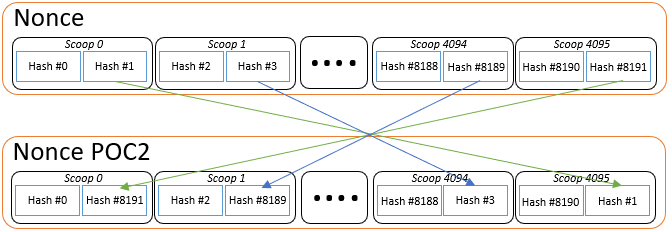

## Abstract
POC2 format plots is consisting of interleaved SHABAL256 hashes and it will prevent time-memory tradeoff for high-range scoops.

## Motivation
Now with the current PoC used with Signum, there indeed are time-memory tradeoffs possible. This attack on PoC mining fairness was possible in theory, but not feasible economically, because the PoW required for this mode of operation consumed far more energy than a PoC mining style.

However recent advancements in hardware and GPU performance do show, that economical feasibility is just a matter of time.

## Specification
The POC2 nonce format is created the same way as when we create POC1 with a slight addition to the end of the process. To create a POC2 formatted nonce we need to shuffle the data around. If we divide the nonce in 2 halves we get a range with scoops 0-2047 and
2048-4095. Let’s call 0-2047 the low scoop range and 2048-4095 the high scoop range. To shuffle the data into correct place we take the second hash from a scoop in the low range and swap it with the second hash in its mirror scoop found in the high range. 
The mirror scoop is calculated like this:

```
MirrorScoop = 4095 – CurrentScoop
```




## Backwards Compatibility
This is a hard forking change, thus breaks compatibility with old fully-validating node. It should not be deployed without widespread consensus.

## Copyright
Copyright and related rights waived via [CC0](https://creativecommons.org/publicdomain/zero/1.0/).
