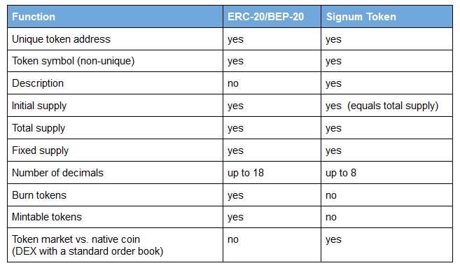

    CIP: 33
    Title: Smart Tokens
    Author: jjos, frank_the_tank
    Status: Draft
    Type: Enhancement (Hard Fork)
    Created: 2021-12-11
    
# Introduction
Most platforms use smart contracts to handle token creation and serve various activities like buying, selling, and transferring from within the smart contract. 
Signum’s approach is different. On the Signum blockchain, tokens are situated similarly to the blockchain’s own native coin (Signa) in that they are unique entities that can be transferred or traded directly between accounts.
Their position is directly attached to accounts, not taken via a smart contract. 

All possible activities are governed by the blockchain nodes’ existing transaction types and logic, making the current token setup “smart”, even though we need to add additional transactions and logic to refine it for a true “smart token” setup.

# Motivation
In 2014, Signum introduced its unique token functionality with the genesis block.  Since that time, not much development has taken place in this particular area of the blockchain.  Surprisingly, when we compare the current features of ERC-20/BEP-20 contracts with the existing Signum setup, we see that our original setup was already forward-looking.

The goal of CIP-33 is to close gaps for our Signum token by adding base functionality and new transaction types to fulfill requirements for mass adoption. Also, to further prepare for the new on-chain native liquidity pools.

To express the new scope with a new term, the new tokens will be named  **Smart Token** after the needed hard-fork.

## Basic enhancements for Smart Tokens

### Creating smart tokens
When creating a smart token, the user will be able to define the token as mintable or non-mintable.  If the token is defined as mintable, the creator will be able to mint additional tokens.  If non-mintable, the token is limited to the initial supply specified at the time of creation.  All existing tokens created prior to the upcoming hard-fork are non-mintable.

The new transaction  for minting tokens will incur a minimum network transaction fee.
(MIN-FEE)

### Burning smart tokens
Any Signum token (including those that existed prior to the hard fork) can be burned by transferring it to address 0 (zero) using the transfer transaction.  After the hard fork, it will be possible to burn Signa  as well by sending to the address 0 (zero).

## Special extensions for Smart Tokens

### Define Treasury Accounts
A new transaction type (**addAssetTreasuryAccount**) will be created that allows a token creator to define Treasury Accounts for a given smart token. Once set, this transaction will not be able to be reverted.  Token balances in these accounts will not be used when calculating circulating supply, nor will the balance in burn address 0.

With this new transaction, the smart token creator can publicly specify on-chain which accounts belong to a use-case.  It will be possible to do this for existing tokens as well.

### Payment to token holders
A use case that is not covered by other blockchain solutions is paying dividends and other income to existing token holders efficiently and without burdening blockchain resources. We will provide a solution addressing this with the upcoming hard fork. We will introduce a new transaction type (distributionToAssetHolder) which allows any account to transfer given amounts of Signa or other smart tokens (or both) to defined smart token holders.

Input parameters for the new transaction:

- Target token 
- Minimum amount needed for a valid distribution (target token)
- Distribution amount (Signa)
- Distribution amount (other smart tokens) 
- Token-ID of the smart token to be distributed

As an example, a user could execute this statement: ”*If you have a minimum of 1.000 token from Smart Token A, you will be qualified for distribution of 20.000 Signa and 10.000 tokens from Smart Token B*”.

For each holder with a given minimum balance, the transaction will calculate their distribution share and transfer the Signa or smart tokens (or both) to their account.

The transaction creator must pay MIN-FEE/10 (currently 0.000735 Signa) per valid distribution recipient or minimum MIN-FEE plus the regular network fee for the transaction (MIN-FEE).
The total amount needed for the distribution must be paid upfront along with the network fee. 

The **distributionToAssetHolder** transaction will be added to a block as a single transaction.  The indirect income will be added to accounts using  the Subscription payment methods as processed by the network nodes’ logic.

This will allow payment of nearly 1.000 smart tokens per block (approximately every 4 minutes) to a theoretically infinite group of token holders.

## Additional Adjustments 

### Transfer Tokens
Anticipating the upcoming smart contract extension for handling tokens, this transaction will be able to send Signa along with the transfer of other tokens. In addition, a user will be able to send Signa and smart tokens in a single transaction, halving the cost of the two transactions needed previously.

### API Call getAssetAccounts
This call now has the new attribute “ignoreTreasury” which is set to true by default.
If this attribute is set to false, the defined Treasury Accounts and the address 0
(burn address) are shown in the result.

## Compatibility
The change will require a hard fork.

With the current release on testnet [https://github.com/signum-network/signum-node/releases/tag/v3.3.0-alpha8](https://github.com/signum-network/signum-node/releases/tag/v3.3.0-alpha8)  the new functionality can be tested via node API.
The Explorer, BTDEX and Phoenix wallet will need to be adjusted to support these new features. The classic wallet will not be able to fully support the new features.

A new explorer is already created for that and can be tested here → [https://t-chain.signum.network/](https://t-chain.signum.network/)

## Copyright
This document is placed in the public domain.

